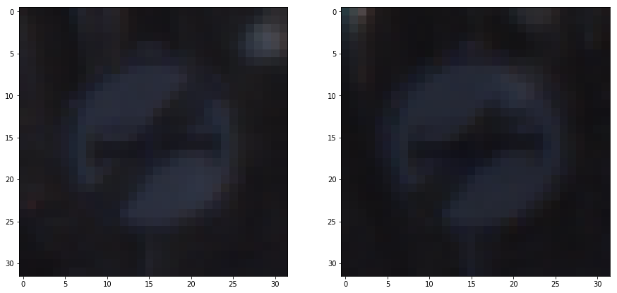
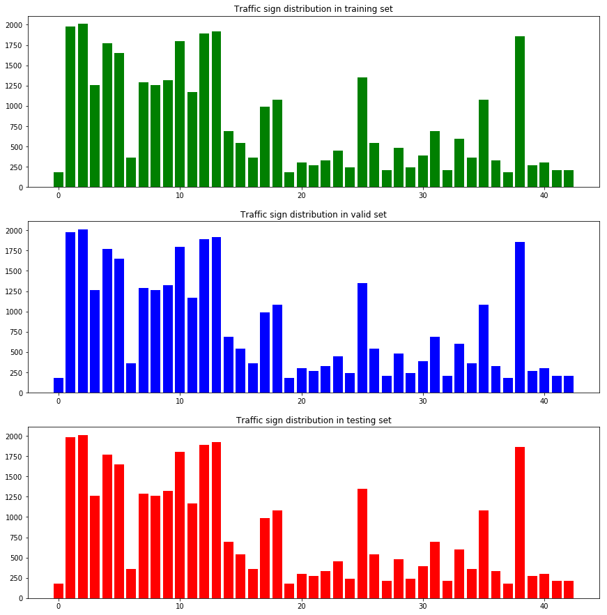
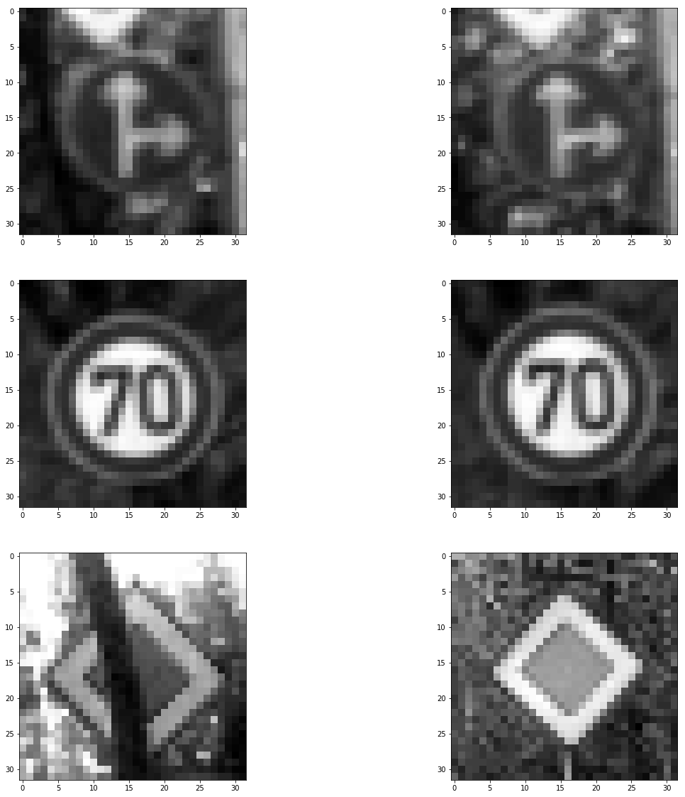
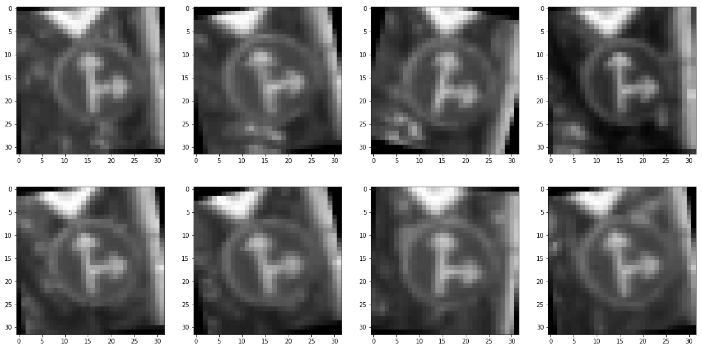
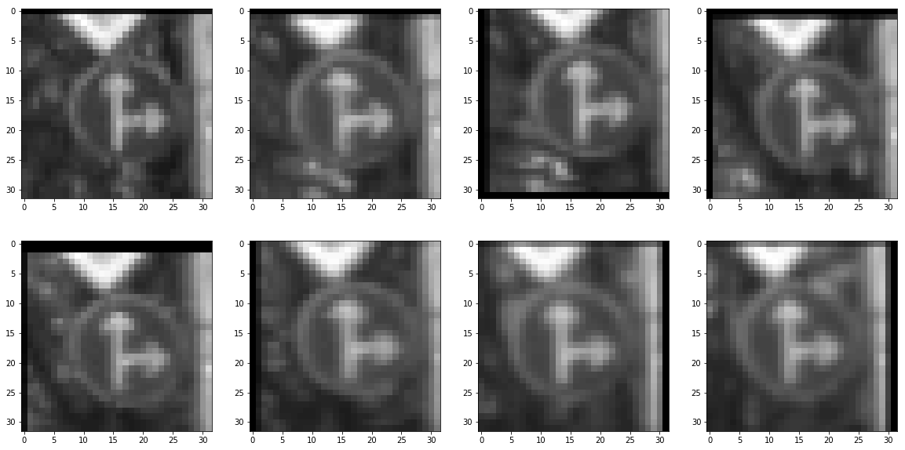
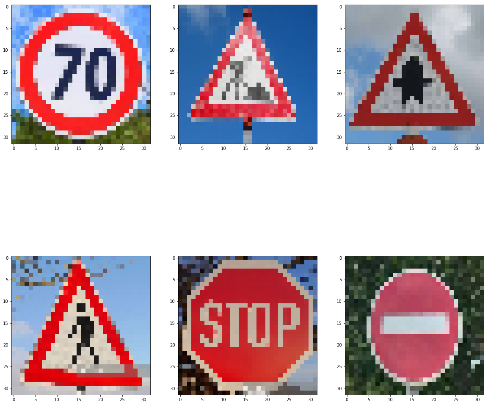

# **Traffic-Sign-Classifier**


**Traffic-Sign-Classifier**

In the project, I used deep neural networks, convolutional neural networoks and image processing to classify German traffic signs. For successfully achieving the goal, several technologies were uesed:

    1. rotate and translate image
    2. Normalizing image data 
    3. Gray scaling
    4. Tensorflow
    5. Convolution Neural Networks
    6. LeNet 5

The LeNet-5 Convolution Neural Networks was first introduced by Yann LeCun et al. in their 1998 paper. The architecture is shown in following figure:


I will implement the architecture for training Traffic Sign Classifier model and modify hyperparameters to increase accuracy for validation set.

## Dataset Exploration

Before configuring and training LeNet-5 Neural Network, it is essential to have an insight about the datasets used for our Network.
   
### Load The Data

```python
# Load pickled data
import pickle

training_file = 'traffic-signs-data/train.p'
validation_file= 'traffic-signs-data/valid.p'
testing_file = 'traffic-signs-data/test.p'

with open(training_file, mode='rb') as f:
    train = pickle.load(f)
with open(validation_file, mode='rb') as f:
    valid = pickle.load(f)
with open(testing_file, mode='rb') as f:
    test = pickle.load(f)
    
X_train_clean, y_train_clean = train['features'], train['labels']
X_valid_clean, y_valid_clean = valid['features'], valid['labels']
X_test_clean, y_test_clean = test['features'], test['labels']


``` 

### Dataset Summary & Exploration
The pickled data is a dictionary with 4 key/value pairs:
* 'feature' is a 4D array containing raw pixel data of the traffic sign images
* 'labels' is a 1D array containing the label of the traffic sign
* 'sizes' is a list representing the orignal width and height the image
* 'coords' is a list representing coordinates of a bounding box around the sign in the image

#### Summary of the data Set

```python
# Number of training examples
n_train = len(X_train_clean)

# Number of validation examples
n_validation = len(X_valid_clean)

# Number of testing examples.
n_test = len(X_test_clean)

# What's the shape of an traffic sign image?
image_shape = X_train_clean[0].shape

# How many unique classes/labels there are in the dataset.
n_classes = 43

print("Number of training examples =", n_train)
print("Number of validation examples =", n_train)
print("Number of testing examples =", n_test)
print("Image data shape =", image_shape)
print("Number of classes =", n_classes)

``` 
```
Number of training examples = 34799
Number of validation examples = 34799
Number of testing examples = 12630
Image data shape = (32, 32, 3)
Number of classes = 43
```

#### Exploratory visualization of the dataset

Matplotlib is used for ploting the some Traffic signs images and ploting the count of each sign.
```python
import matplotlib.pyplot as plt
import random
import numpy as np
import cv2

%matplotlib inline


index = 195

plt.figure(figsize=(15,15))
plt.subplot(1,2,1)
plt.imshow(X_train_clean[index])


plt.subplot(1,2,2)
plt.imshow(X_train_clean[index+2])

``` 



Also I am quite interested in percetage for each sign in dataset. 
```python
plt.figure(figsize=(30,20))
fig, axarr = plt.subplots(3)
hist1 = np.bincount(y_train_clean)
hist2 = np.bincount(y_valid_clean)
hist3 = np.bincount(y_test_clean)
axarr[0].bar(range(0,43), hist1,  align='center',color='green')
axarr[0].set_title('Traffic sign distribution in training set')
axarr[1].bar(range(0,43), hist1,  align='center',color='blue')
axarr[1].set_title('Traffic sign distribution in valid set')
axarr[2].bar(range(0,43), hist1,  align='center',color='red')
axarr[2].set_title('Traffic sign distribution in testing set')
plt.subplots_adjust(left = 0.1, right = 2, bottom = 0.1, top = 3,hspace = 0.2)
plt.show()

```


```python
import csv

with open('signnames.csv') as file:
    reader = csv.DictReader(file)
    signs = {}
    print("{0:<10}".format("ClassID"),"{0:<53}".format("SignName")
          ,"{0:<15}".format("% Train"),"{0:<20}".format("% Validation"), "{0:<5}".format("% Test"))
    for row in reader:
        index = int(row["ClassId"])
        print("{0:<10}".format(index),"{0:<50}".format(row['SignName'])
              ,"{0:10.3f}".format(np.count_nonzero(y_train_clean == index)*100/n_train)
              ,"{0:15.3f}".format(np.count_nonzero(y_valid_clean == index)*100/n_validation)
              ,"{0:19.3f}".format(np.count_nonzero(y_test_clean == index)*100/n_test))
        signs[int(row["ClassId"])] = row['SignName']

```
    ClassID    SignName                                              % Train         % Validation         % Test
    0          Speed limit (20km/h)                                    0.517           0.680               0.475
    1          Speed limit (30km/h)                                    5.690           5.442               5.701
    2          Speed limit (50km/h)                                    5.776           5.442               5.938
    3          Speed limit (60km/h)                                    3.621           3.401               3.563
    4          Speed limit (70km/h)                                    5.086           4.762               5.226
    5          Speed limit (80km/h)                                    4.742           4.762               4.988
    6          End of speed limit (80km/h)                             1.035           1.361               1.188
    7          Speed limit (100km/h)                                   3.707           3.401               3.563
    8          Speed limit (120km/h)                                   3.621           3.401               3.563
    9          No passing                                              3.793           3.401               3.800
    10         No passing for vehicles over 3.5 metric tons            5.173           4.762               5.226
    11         Right-of-way at the next intersection                   3.362           3.401               3.325
    12         Priority road                                           5.431           4.762               5.463
    13         Yield                                                   5.517           5.442               5.701
    14         Stop                                                    1.983           2.041               2.138
    15         No vehicles                                             1.552           2.041               1.663
    16         Vehicles over 3.5 metric tons prohibited                1.035           1.361               1.188
    17         No entry                                                2.845           2.721               2.850
    18         General caution                                         3.104           2.721               3.088
    19         Dangerous curve to the left                             0.517           0.680               0.475
    20         Dangerous curve to the right                            0.862           1.361               0.713
    21         Double curve                                            0.776           1.361               0.713
    22         Bumpy road                                              0.948           1.361               0.950
    23         Slippery road                                           1.293           1.361               1.188
    24         Road narrows on the right                               0.690           0.680               0.713
    25         Road work                                               3.879           3.401               3.800
    26         Traffic signals                                         1.552           1.361               1.425
    27         Pedestrians                                             0.603           0.680               0.475
    28         Children crossing                                       1.379           1.361               1.188
    29         Bicycles crossing                                       0.690           0.680               0.713
    30         Beware of ice/snow                                      1.121           1.361               1.188
    31         Wild animals crossing                                   1.983           2.041               2.138
    32         End of all speed and passing limits                     0.603           0.680               0.475
    33         Turn right ahead                                        1.721           2.041               1.663
    34         Turn left ahead                                         1.035           1.361               0.950
    35         Ahead only                                              3.104           2.721               3.088
    36         Go straight or right                                    0.948           1.361               0.950
    37         Go straight or left                                     0.517           0.680               0.475
    38         Keep right                                              5.345           4.762               5.463
    39         Keep left                                               0.776           0.680               0.713
    40         Roundabout mandatory                                    0.862           1.361               0.713
    41         End of no passing                                       0.603           0.680               0.475
    42         End of no passing by vehicles over 3.5 metric tons      0.603           0.680               0.713


It looks like the the distribution for each sign in various dataset(train, validation, test) is similiar. It is important because if the distributions are quite different, the model trained by train dataset can not guarantee it will have similiar performance/accuracy.


## Design and Test a Model Architecture
For this project, I used LeNet-5 convolutional neural network and in order to increase the prediction accuracy, several technologies are implemented: grayscaling, normalizing, image rotation and translation

#### Preprocess the Data set

Grayscaling the data set
In fact the color for traffic sign is not a key paramter for classifying them, so transformation from RGB to grayscale will be significantly decrease the number of inputs.

```python
import matplotlib.pyplot as plt
import random
import numpy as np

%matplotlib inline

## make copies for train, valid, test data set
X_train = np.copy(X_train_clean)
y_train = np.copy(y_train_clean)

X_valid = np.copy(X_valid_clean)
y_valid = np.copy(y_valid_clean)

X_test = np.copy(X_test_clean)
y_test = np.copy(y_test_clean)

###Gray scaling the data
from sklearn.utils import shuffle


def grayscale(X_data):
    gray_images = []
    for image in X_data:
        gray_image = cv2.cvtColor(image, cv2.COLOR_RGB2GRAY)
        gray_image = gray_image[:,:,np.newaxis]
        gray_images.append(gray_image)
        
    gray_images = np.asarray(gray_images)
    
    return gray_images

gray_train_images = grayscale(X_train)
gray_valid_images = grayscale(X_valid)
gray_test_images = grayscale(X_test)

index_offset = 1010
plt.figure(figsize=(20,20))    
plt.subplot(3,2,1)
plt.imshow(gray_train_images[index_offset].squeeze(),cmap='gray')

plt.subplot(3,2,2)
plt.imshow(gray_train_images[index_offset+1].squeeze(),cmap='gray')

plt.subplot(3,2,3)
plt.imshow(gray_valid_images[index_offset].squeeze(),cmap='gray')

plt.subplot(3,2,4)
plt.imshow(gray_valid_images[index_offset+1].squeeze(),cmap='gray')

plt.subplot(3,2,5)
plt.imshow(gray_test_images[index_offset-2].squeeze(),cmap='gray')

plt.subplot(3,2,6)
plt.imshow(gray_test_images[index_offset-1].squeeze(),cmap='gray')

```


Normalizing data set 
```python
## Normalized Data set
Normalized_X_train = (gray_train_images - np.float32(128)) / np.float32(128)
Normalized_X_valid = (gray_valid_images - np.float32(128)) / np.float32(128)
Normalized_X_test = (gray_test_images - np.float32(128)) / np.float32(128)

X_train, y_train = shuffle(Normalized_X_train, y_train_clean)
X_valid, y_valid = shuffle(Normalized_X_valid, y_valid_clean)
X_test, y_test = shuffle(Normalized_X_test, y_test_clean)
```
### Rotate the images and generate a new training data set
Because in reality, the image captured by camera something will have some rotation. So it is reasonable that when we train the model, the train data set should contain the scenario that images rotated by some angels. The method I implemented is that I randomly rotate the original data set from -15 to 15 degree and generate a new training data set to train the model.
```python 
import random

def rotation(X_data):
    X_data = X_data.squeeze()
    n_data = len(X_data)
    rand_nums = list([random.uniform(-1,1) for i in range(n_data)])
    Rot_X_images = []
    for i, image in enumerate(X_data):
        rows, cols = image.shape
        rot_ang = 15 * rand_nums[i]
        M = cv2.getRotationMatrix2D((cols/2,rows/2),rot_ang,1)
        Rot_X_image = cv2.warpAffine(image,M,(cols,rows))
        Rot_X_image = Rot_X_image[:,:,np.newaxis]
        Rot_X_images.append(Rot_X_image)
    
    return np.asarray(Rot_X_images)
    
X_train_rot = rotation(gray_train_images)

index = 1000


plt.figure(figsize=(20,10))
for i in range(0,8):
    plt.subplot(2,4,i+1)
    plt.imshow(X_train_rot[index+i].squeeze(),cmap='gray')
plt.show()

```



### Translate the images and generate a new train data set
Similarly, the sign in the image sometime can not perfectly located in the middle of image. So our training data set also need to include the scenario that the sign will have some shift away from middle of image. The way I have done is that I randomly shift the object's location on horizontal and vertical position from -2 to 2 pixel and generate a new training data set to train the model.
```python 
def translation(X_data):
    X_data = X_data.squeeze()
    n_data = len(X_data)
    rand_nums = list([random.uniform(-2,2) for i in range(n_data)])
    rand_nums2 = list([random.uniform(-2,2) for i in range(n_data)])
    trans_X_images = []
    for i, image in enumerate(X_data):
        rows, cols = image.shape
        h_shift = rand_nums[i]
        v_shift = rand_nums2[i]
        M = np.float32([[1,0,h_shift],[0,1,v_shift]])
        trans_X_image = cv2.warpAffine(image,M,(cols,rows))
        trans_X_image = trans_X_image[:,:,np.newaxis]
        trans_X_images.append(trans_X_image)
    
    return np.asarray(trans_X_images)

X_train_trans = translation(gray_train_images)

index = 1000

plt.figure(figsize=(20,10))
for i in range(0,8):
    plt.subplot(2,4,i+1)
    plt.imshow(X_train_trans[index+i].squeeze(),cmap='gray')
plt.show()

```



### Model Architecture
To classify the traffic sign and train the model, I choosed AdamOptimizer at a learning rate of 0.001. The batch size is 128 training samples. And 25 epochs is choose for training on CPU.

I choose LeNet-5 Neural Network architecture. The detail of each layer is following:
``` Layer 1: Convolutional. Input = 32x32x1, output = 28x28x6.
             RELU
             Max_pool  filter = 2x2x1, stride = 2x2x1, padding = Valid, output = 14x14x6
    Layer 2: Convolutional. 14x14x16, output = 10x10x6.
             RELU
             Max_pool  filter = 2x2x1, stride = 2x2x1, padding = Valid, output = 5x5x16
             Flatten   Input = 5x5x16, output = 400
    Layer 3: Fully connected. 400, output = 120.
             RELU
             dropout   keep_prob = 0.7
    Layer 4: Fully connected. 120, output = 84.
             RELU
             dropout   keep_prob = 0.7
    Layer 5: Fully connected. 84, output = 43.
```

The LeNet-5 network contain the two convolution layers and three fulled connected layers. The RELU activation functions are used after convolution or fully connection in each layer. Outputs for convolutional layer feed through Maxpool after RELU. And output for fully connection layer feed through dropout after RELU. The keep_prob for dropout I choose 0.7 to prevent overfitting.

### Model Training
There are three steps for training the model. 
At first, I used the normal data set which is only processed by grayscaling and normalizing to train the model. 
After 25 epochs, the result is following:
* Training Accuracy = 0.982
* Validation Accuracy = 0.959
* Test Accuracy = 0.938

Secondly, I used the rotated data set to train the model:
* Training Accuracy = 0.98405
* Validation Accuracy = 0.96984
* Test Accuracy = 0.94505

Threely, I used the translated data set to train the model:
* Training Accuracy = 0.98095   
* Validation Accuracy = 0.96508   
* Test Accuracy = 0.95265

It easily can see that rotated data set increase around 1% for validation accuray and test accuracy. and translated data set increase test accuracy to 95.265%.

## Test a model on New Images
I download 6 Germany traffic sign images from Internet. 


The images from Internet have fine resolution and the sizes are much large than 32X32, so my concern is that when I resize those images to 32X32 by using opencv2, the sharpness and resolution will decrese significantly, which will cause a issue to classify the sign for my model.

After resizing the images as 32x32x3 for my network and the figure like following:


Then grayscaling and normalizing the images. the predict result is :
``` 
         Prediction                                Reality
Sign 1: Speed limit (30km/h)                      Speed limit (70km/h)
Sign 2: Road work                                 Road work
Sign 3: Right-of-way at the next intersection     Right-of-way at the next intersection
Sign 4: Pedestrians                               Pedestrians
Sign 5: Stop                                      Stop
Sign 6: No entry                                  No entry
```
The model classify 5 of 6 traffic signs, Only the speed limit (70km/h) classify to speed limit (30km/h). the accuracy is 83.3%

The top five soft max probabilites for the 6 new image is following:
```
                                             Top 5 Softmax Probabilities            
Sign  1 : Speed limit (30km/h) |  Speed limit (20km/h) |  Bumpy road   |  Beware of ice/snow  |  Bicycles crossing
               1.00000         |  0.00000              |  0.00000      |  0.00000            |  0.00000
Sign  2 : Road work    |  Road narrows on the right   |   Bumpy road   |  Beware of ice/snow  |  Bicycles crossing
          0.99986      |        0.00012               |   0.00002      |   0.00000            |  0.00000
Sign  3 : Right-of-way at the next intersection|Beware of ice/snow | Bumpy road | Beware of ice/snow  |  Bicycles crossing
          1.00000                              |      0.00000      |  0.00000   |    0.00000          |  0.00000
Sign  4 : Pedestrians  |  Right-of-way at the next intersection |  Bumpy road   |  Beware of ice/snow  |  Bicycles crossing
          1.00000      |               0.00000                  |  0.00000      |   0.00000            |  0.00000
Sign  5 : Stop         |  Keep left    |  Bumpy road   |  Beware of ice/snow  |  Bicycles crossing
          0.99936      |  0.00035      |  0.00022      |  0.00000             |  0.00000
Sign  6 : No entry     |  Stop         |  Bumpy road   |  Beware of ice/snow  |  Bicycles crossing
          1.00000      |  0.00000      |  0.00000      |  0.00000             |  0.00000

```
The model classifies sign 1, sign 3, sign 4, sign 6 with almost 100% certainty. the certainties for rest signs are also 99%. 
And there is one more thing I make my attention. The model disclassify sign 1 as speed limit(30km/h), the correct sign, speed limit (70km/h), is at the top five soft max probabilities. In my opinion there are two opinion for this situation: 1. as I mentioned above, after resizing, the images become hard to recongize by the model. 2. Training data set probably is incompleted for some scenario, such as scaling, squeeze, stroke width and color perturbation. 


    
