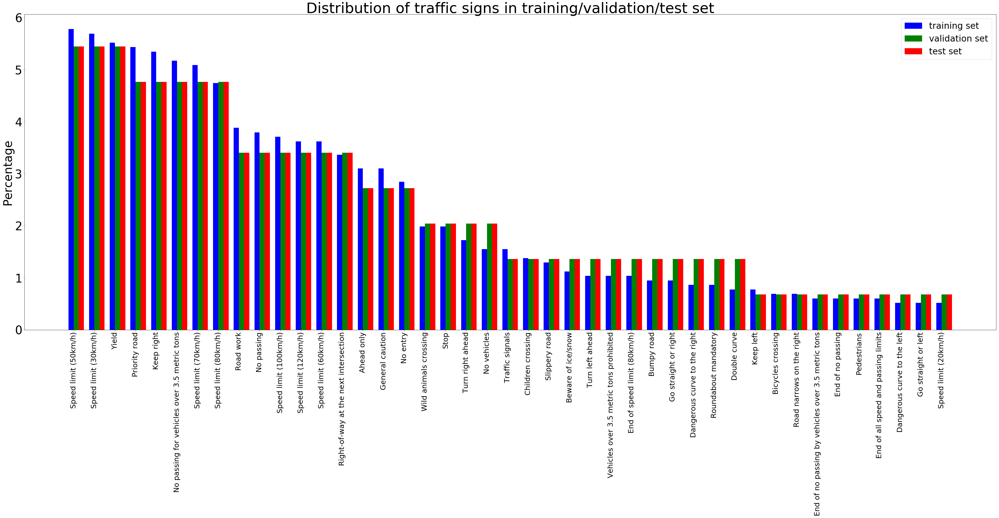
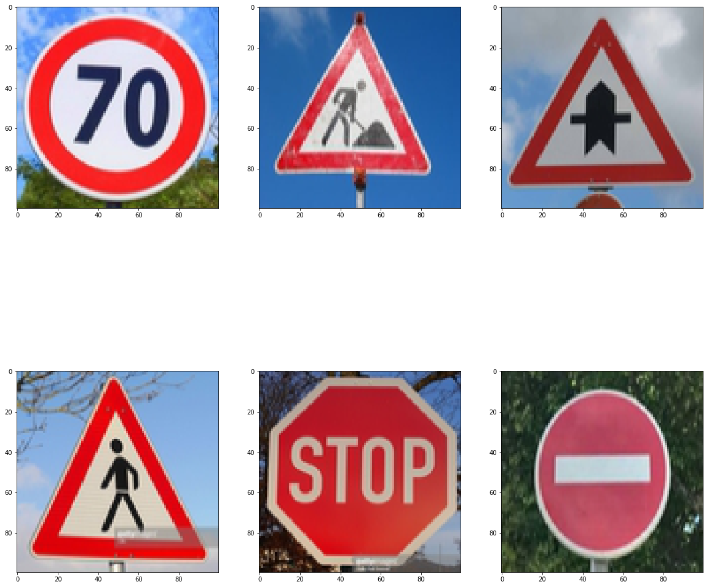

# **Traffic-Sign-Classifier**


**Traffic-Sign-Classifier**

In the project, I used deep neural networks, convolutional neural networoks and image processing to classify German traffic signs. For successfully achieving the goal, several technologies were uesed:

    1. rotate and translate image
    2. Normalizing image data 
    3. Gray scaling
    4. Tensorflow
    5. Convolution Neural Networks
    6. LeNet 5

After auditing standford cs231n(Convolutional Neural Network for Visual recognition), I revisited the project and aim to explore the further processing to improve accuracy on test set and valid set by using some knowledge know from that course. The LeNet-5 Convolution Neural Networks was first introduced by Yann LeCun et al. in their 1998 paper. The architecture is shown in following figure:


In the new project, By modified the nerual networks architecture in several ways, the valid set accuracy and test set accuray are increased from 96.7% to 99.5%, from 95.2% to 98.6% . The modifications will be explaned later. 


## Dataset Exploration

Before configuring and training my Neural Network, it is essential to have an insight about the datasets used for our Network.
   
The German Traffic signs recognition benchmark(GTSRB) is a computer vision and machine learning benchmark and a classification challenge held at IJCNN 2011. And in the final competition of GTSRB 2011, the final ranking for all participants is:


| Rank            | Representative | Method    |        Correct recognition rate        |
|:---------------:|:---------------:|:----------:|:--------------------:|
| 1           | Dan Ciresan       |  Committee of CNNs    |     99.46 %      | 
| 2              |     |  Human Performance  |          98.84 %          |
| 3         |       Pierre Sermanet   | Multi-Scale CNNs |   98.31 %     |
| 4       |     Fatin Zaklouta  |   Random Forests   |96.14 %   |


It contain 43 classes and more than 50,000 images in total. Our data set has been seperated into three different sets: training set(34,799 images), validation set(4410 images) and testing set(12630 images). 
And the shape of each image is 32X32X3. 

### Exploratory visualization of the dataset 
I colleceted the labels in the data set and summarized the distribution around all classes, the below table is shown:

|ClassID    |SignName                                              |% Train         |% Validation         |% Test|
|:---------:|:----------------------------------------------------:|:--------------:|:--------------------:|:---------:|
|    0      |    Speed limit (20km/h)                              |      0.517     |     0.680            |   0.475|
|    1      |    Speed limit (30km/h)                              |      5.690     |      5.442            |   5.701|
|    2      |    Speed limit (50km/h)                              |      5.776      |     5.442             |  5.938|
|    3      |    Speed limit (60km/h)                              |      3.621      |     3.401             |  3.563|
|    4      |    Speed limit (70km/h)                              |      5.086      |    4.762             |  5.226|
|    5      |    Speed limit (80km/h)                              |      4.742      |     4.762             |  4.988|
|    6      |    End of speed limit (80km/h)                       |      1.035      |     1.361             |  1.188|
|    7      |    Speed limit (100km/h)                             |      3.707      |     3.401             |  3.563|
|    8      |    Speed limit (120km/h)                             |     3.621      |     3.401             |  3.563|
|    9      |    No passing                                        |      3.793      |     3.401             |  3.800|
|    10     |    No passing for vehicles over 3.5 metric tons      |      5.173      |     4.762             |  5.226|
|    11     |    Right-of-way at the next intersection             |      3.362      |     3.401             |  3.325|
|    12     |    Priority road                                     |      5.431      |     4.762             |  5.463|
|    13     |    Yield                                             |      5.517      |     5.442             |  5.701|
|    14     |    Stop                                              |      1.983      |    2.041             |  2.138|
|    15     |    No vehicles                                       |      1.552      |     2.041             |  1.663|
|    16     |    Vehicles over 3.5 metric tons prohibited          |      1.035      |    1.361             |  1.188|
|    17     |    No entry                                          |     2.845      |     2.721             |  2.850|
|    18     |    General caution                                   |      3.104      |     2.721             |  3.088|
|    19     |    Dangerous curve to the left                       |      0.517      |     0.680             |  0.475|
|    20     |    Dangerous curve to the right                      |      0.862      |     1.361             |  0.713|
|    21     |    Double curve                                      |      0.776      |     1.361             |  0.713|
|    22     |    Bumpy road                                        |      0.948      |     1.361             |  0.950|
|    23     |    Slippery road                                     |      1.293      |     1.361             |  1.188|
|    24     |    Road narrows on the right                         |      0.690      |     0.680             |  0.713|
|    25     |    Road work                                         |      3.879      |     3.401             |  3.800|
|    26     |    Traffic signals                                   |      1.552      |     1.361             |  1.425|
|    27     |    Pedestrians                                       |      0.603      |     0.680             |  0.475|
|    28     |    Children crossing                                 |      1.379      |     1.361             |  1.188|
|    29     |    Bicycles crossing                                 |      0.690      |     0.680             |  0.713|
|    30     |    Beware of ice/snow                                |      1.121      |     1.361             |  1.188|
|    31     |    Wild animals crossing                             |      1.983      |     2.041             |  2.138|
|    32     |    End of all speed and passing limits               |      0.603      |     0.680             |  0.475|
|    33     |    Turn right ahead                                  |      1.721      |     2.041             |  1.663|
|    34     |    Turn left ahead                                   |      1.035      |     1.361             |  0.950|
|    35     |    Ahead only                                        |      3.104      |     2.721             |  3.088|
|    36     |    Go straight or right                              |      0.948      |     1.361             |  0.950|
|    37     |    Go straight or left                               |      0.517      |     0.680             |  0.475|
|    38     |    Keep right                                        |      5.345      |     4.762             |  5.463|
|    39     |    Keep left                                         |      0.776      |     0.680             |  0.713|
|    40     |    Roundabout mandatory                              |      0.862      |     1.361             |  0.713|
|    41     |    End of no passing                                 |      0.603      |     0.680             |  0.475|
|    42     |    End of no passing by vehicles over 3.5 metric tons|      0.603      |     0.680             |  0.713|

I also plot a histogram for the above data, which is intuitive to see the distribution of data sets.



It looks like the the distribution for each sign in various dataset(train, validation, test) is similiar. It is important because if the distributions are quite different, the model trained by train dataset can not guarantee it will have similiar performance/accuracy.

And there is one more thing that should be discussed. We can easily that the pecentages of different signs are various on data set. if we feed these data set into our neural network, after several epoches training our network will have a higher posibility to bias toward the images with higher occupyation in data set. If the network need to predict images evenly, we can generate some extra modified data into data set and make the data set uniformly distributed. However, in the project, I wouldn't process the data set like that. Because the uneven distribution just show how often we can meet the sign on driving. In other words, the sign with higher percentage on data set means it have a higher possibility shown on the road. So it make sense that our network have a bias toward this sign.  


## Design and Test a Model Architecture
For this project, I configured my own neural network based on Lenet-5 and implemented several preprocess and data augmentation technologies:  
  * grayscaling 
  * Contrast-Limited Adaptive Histogram Equalization(CLAHE) 
  * normalizing
  * image rotation, translation and shear
  

#### Preprocess the Data set

Grayscaling the data set
In fact the color for traffic sign is not a key paramter for classifying them, so transformation from RGB to grayscale will be significantly decrease the number of inputs.


Contrast-Limited Adaptive Histogram Equalization(CLAHE)
we can see that some image whose pixel values are confined to some specific range of value only. But a good image should have pixels from all regions of the image. so we need a technology to stretch pixel values to either end. That is Histogram Equalization, which normally improves the contrast of the image. 
However, because histogram equalization considers the global contrast of the image, sometime it will result in over-brightness on some of region in image. The contrast-Limited Adaptive Histogram Equalization(CLAHE) can avoid the issue. 
I plot the following figures by implementing histogram equalization and CLAHE:


The first column image is grayscaled image from origin RGB image. and second column is applied by histogram equalization. Third column are image implemented by CLAHE
We can easily see that after histogram equalizing some of images suffered from over-brightness on some regions, even though it improves the contrast of image. CLAHE solve the issue in third column image. CLAHE not only improves the contrast of image, but also prevented image from over-brightness.


Normalizing data set 
The final setup for preprocessing data is normalizing data set, which prevent program from computation error due to large scale value computation during training neural network.


### Rotate the images and generate a new training data set
Because in reality, the image captured by camera something will have some rotation. So it is reasonable that when we train the model, the train data set should contain the scenario that images rotated by some angels. The method I implemented is that I randomly rotate the original data set from -15 to 15 degree and generate a new training data set to train the model.


### Translate the images and generate a new train data set
Similarly, the sign in the image sometime can not perfectly located in the middle of image. So our training data set also need to include the scenario that the sign will have some shift away from middle of image. The way I have done is that I randomly shift the object's location on horizontal and vertical position from -5 to 5 pixel and generate a new training data set to train the model.


### Shearing the image
And in order to improve generalization of data set shearing is also a good way, which displaces each point in fixed direction.


I generate 10 new images for each image in the training set by using above techniques, so the number of my training set will be 382789 .

### Model Architecture

The architecture I used was converged after trying several different architectures. Following figure show the architecture:


The input layer is 32X32 grey scaled image, which is preprocessed before feeding into network. Because color of traffic sign is less important than it's pattern. so in order to reduce the dimension of input, the image transfer from RGB to gray scale.

Then for the next 3 grouped module, each of module contain three 3X3 convolution filters followed by 2X2 maxpooling. The output of these convolution layer will feedforward into two 2048 fully connection layers, which is usd to combine the features extracted from last convolution layers to create a model to make a prediction. Additional 0.5 dropout layers are applied after each of the fully connected layers to avoid overfitting.

The last softmax layer will compute the cross-entropy loss of the prediction. Moreover, L2 regularization loss of weights is applied with cross-entropy loss to penalize large weights.


### Model Training and design
In the section, I will explain detail of the architecture and the approach to finding a solution.

At the begin, I just use the vanillna Lenet-5 architecture and the highest training accuracy and test accuray I can achieve are 98.4% and 95.2% separately no matter how I tuned hyparameters.

Recently, when I finish cs231n course, I have deeper understanding about deep learning and convolution neural network. so I come back to the project and optimize the architecture.

Instead of only one convolution layer before max pooling layer, new architecture stack two convolution layers before max pool layer, whose benefit is multiple stacked conv layers can develop more complex feature of the input volume before the destructive pooling operation. And two serial 3X3 conv filters for each module has a same receptive field size with using single 5X5 conv filter and single
5X5 conv layer will contain more parameter compared with two stacked 3X3 conv layer.

And in the previous architecture, I set padding parameter as "VALID", the operation means that conv layer were to not zero-pad the inputs and only perform valid convolution, then the size of the volumes would reduce by a small amout after each conv and the information at the borders would be "washed away" too quickly(refered to  [cs231](http://cs231n.github.io/convolutional-networks))
The new architecture keep the spatial size constant after each conv layer and make neural network can go deeper and leave all spatial down-sampling to the max pool layers.

From the previous results, I found the training accuracy only reach at 98.4%, which can be estimated as underfitting. So the straightforward way to overcome the issue is to add more layers, in other words, make network deeper.

So I stack two 3X3 conv layers with relu before max pooling and stack three this kind of pattern before fully connected layers. And depth of conv layers is increasing from 32 to 128, which will make neural network can capture some minor features from input. 

Then output of conv layers will feedward into two 2048 fully connection layers, which can combine the features extracted from previous conv layers to create a model to predict score for each class.
That is the main frame of my new architecture. 

The next step is to choose which optimizer for updating parameters. Actually, because of great performance, adam become the default optimizer for many developer. In order to explain the reason why adam is so popular, we have to point out what are key shortcominges for Stochastic gradient descent(SGD): 
 
    1. there is a possible that one of dimension is quite sensitive for loss change, in the figure one horizontal direction will be sensitive, the step may take zigzag back and forth. The converge progress will be slow. And the problem will become much more common in high dimensions.
    2. Can’t deal with local minima and saddle point: when gradient reach to zero, so we can’t make any progress and stuck at this, it is also much common on high dimensions.
    
Adam optimizer overcome the above issues. It's magnitudes of parameter updates are invariant to rescaling of the gradient, its stepsizes are approximately bounded by the stepsize hyperparameter, it does not require a stationary objective, it also works with sparse gradients and naturally performs a form of step size annealing.

There are several hyperparametes need to be tuned to fit my network, learning rate, batch size, regularization parameters(L2 penalty, droupout strength).
And the benchmark for estimating the model is accuracies for training data set, validation data set and test data set.

The strategy for tuning those parameters is searching from coarse to fine. the search range for learning rate and L2 regularization is from 1 to 0.000001 and step is 0.1. we can easily see that some parameters setting lead the model to not learn at all, in other word, training accuray can't keep increasing. At the end I narrow down learning rate and L2 penalty range from 0.0001 to 0.001.

Batch size can affect traning process in two way: the smaller batch size tend to noisier the training data is, However larger value, the longer it will take to compute the gradient for each step.

In the project, in order to training my model faster and so I upgrade the hardware to 4 CPU with 26 GB memory cooperated with 16GB NVIDIA Tesla T4

So I prefer to set batch size larger. After some paramter setting, 256 batch size perform more stable on accuracy and computation time is reasonable.

The dropout strength started at 0.8, and modified during training, if model is overfitting, the value will decrease. The final value is settled down at 0.5.

The following table is my training process

|    Architecture      | Data augmentation  | batch size | learning rate    |   L2 penalty   |   dropout value  | Training accuracy | Valid accuracy | Test accuracy |
|:---------------:|:---------------:|:----------:|:-----------:|:----------:|:-------------:|:-----------:|:--------:|:-----------:|
| Lenet-5          |  104397 (grayscaling + translation + rotation)  |  128   |     0.001     |  0.000 |    0.7| 98.1%+/- 0.2%     | 96.5%+/- 0.2%   |  95.3%+/- 0.2%   |
| Current Architecture   |  104397 (grayscaling + translation + rotation + shear + histrogram equalization)  |  128   |     0.001     |  0.001 |    0.7|  98.9%+/- 0.2%     | 98.7%+/- 0.2%   |  96.7%+/- 0.2%   |
| Current Architecture      |         173995 (grayscaling + translation + rotation + shear + histrogram equalization)  |  128   |     0.001     |  0.001 |    0.7     | 99.3%+/- 0.2%     | 99.2%+/- 0.2%   |  96.9%+/- 0.2%   |
| Current Architecture   |     173995 (grayscaling + translation + rotation + shear + CLAHE)  |  128   |     0.001     |  0.001 |    0.7      | 99.2%+/- 0.2%     | 99.2%+/- 0.2%   |  97.3%+/- 0.2%   |
| Current Architecture   |  173995 (grayscaling + translation + rotation + shear + CLAHE)  |  256   |     0.001     |  0.001 |    0.7| 99.3%+/- 0.2%     | 99.2%+/- 0.2%   |  97.6%+/- 0.2%    |
| Current Architecture   |  173995 (grayscaling + translation + rotation + shear + CLAHE)  |  256   |     0.001     |  0.003 |    0.7| 99.5%+/- 0.2%     | 99.3%+/- 0.2%   |  97.4%+/- 0.2%   |
| Current Architecture   |  382789 (grayscaling + translation + rotation + shear + CLAHE)  |  256   |     0.001     |  0.0001 |    0.7| 99.7%+/- 0.2%     | 99.4%+/- 0.2%   |  97.9%+/- 0.2%   |
| Current Architecture   |  382789 (grayscaling + translation + rotation + shear + CLAHE)  |  256   |     0.001     |  0.0001 |    0.5| 99.8%+/- 0.1%     | 99.5%+/- 0.2%   |  98.4%+/- 0.2%  |

The final hyperparamters setting is batch size:256, learning rate:0.001, L2 penalty: 0.0001, dropout value: 0.5. And the Training accuracy is 99.8%+/- 0.1% , validation accuray is 99.5%+/- 0.1%  and Test accuracy is 98.4%+/- 0.2%.

## Test a model on New Images
I download 6 Germany traffic sign images from Internet. 



The images from Internet have fine resolution and the sizes are much large than 32X32, so my concern is that when I resize those images to 32X32 by using opencv2, the sharpness and resolution will decrese significantly, which will cause a issue to classify the sign for my model.

After resizing the images as 32x32x3 for my network and the figure like following:


Then grayscaling and normalizing the images. the predict result is :
``` 
         Prediction                                Reality
Sign 1: Speed limit (30km/h)                      Speed limit (70km/h)
Sign 2: Road work                                 Road work
Sign 3: Right-of-way at the next intersection     Right-of-way at the next intersection
Sign 4: Pedestrians                               Pedestrians
Sign 5: Stop                                      Stop
Sign 6: No entry                                  No entry
```
The model classify 5 of 6 traffic signs, Only the speed limit (70km/h) classify to speed limit (30km/h). the accuracy is 83.3%

The top five soft max probabilites for the 6 new image is following:


                                             Top 5 Softmax Probabilities 
|:---------:|:----------------:|:------------:|:-----------:|:------------:|           
Sign  1 : Speed limit (30km/h) |  Speed limit (20km/h) |  Bumpy road   |  Beware of ice/snow  |  Bicycles crossing|
               1.00000         |  0.00000              |  0.00000      |  0.00000            |  0.00000|
Sign  2 : Road work    |  Road narrows on the right   |   Bumpy road   |  Beware of ice/snow  |  Bicycles crossing|
          0.99986      |        0.00012               |   0.00002      |   0.00000            |  0.00000|
Sign  3 : Right-of-way at the next intersection|Beware of ice/snow | Bumpy road | Beware of ice/snow  |  Bicycles crossing|
          1.00000                              |      0.00000      |  0.00000   |    0.00000          |  0.00000|
Sign  4 : Pedestrians  |  Right-of-way at the next intersection |  Bumpy road   |  Beware of ice/snow  |  Bicycles crossing|
          1.00000      |               0.00000                  |  0.00000      |   0.00000            |  0.00000|
Sign  5 : Stop         |  Keep left    |  Bumpy road   |  Beware of ice/snow  |  Bicycles crossing|
          0.99936      |  0.00035      |  0.00022      |  0.00000             |  0.00000|
Sign  6 : No entry     |  Stop         |  Bumpy road   |  Beware of ice/snow  |  Bicycles crossing|
          1.00000      |  0.00000      |  0.00000      |  0.00000             |  0.00000|


The model classifies sign 1, sign 3, sign 4, sign 6 with almost 100% certainty. the certainties for rest signs are also 99%. 
And there is one more thing I make my attention. The model disclassify sign 1 as speed limit(30km/h), the correct sign, speed limit (70km/h), is at the top five soft max probabilities. In my opinion there are two opinion for this situation: 1. as I mentioned above, after resizing, the images become hard to recongize by the model. 2. Training data set probably is incompleted for some scenario, such as scaling, squeeze, stroke width and color perturbation. 


    
